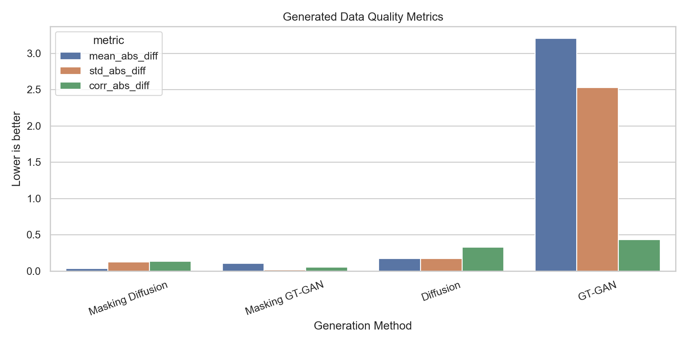
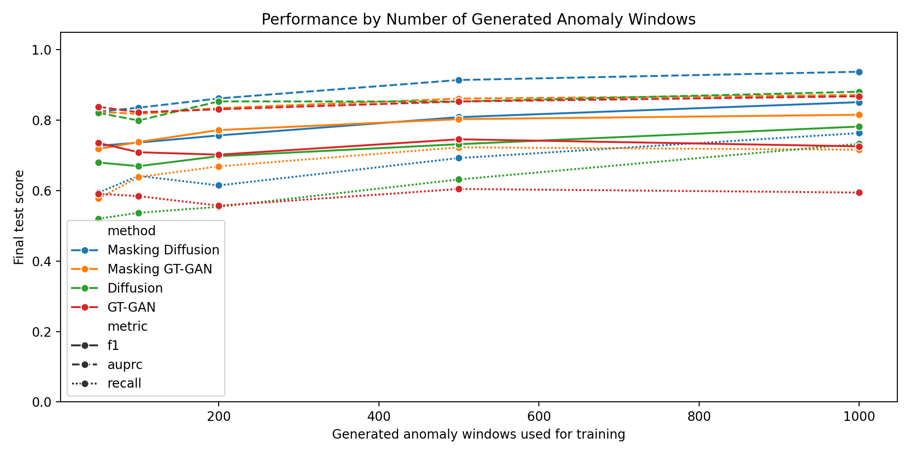
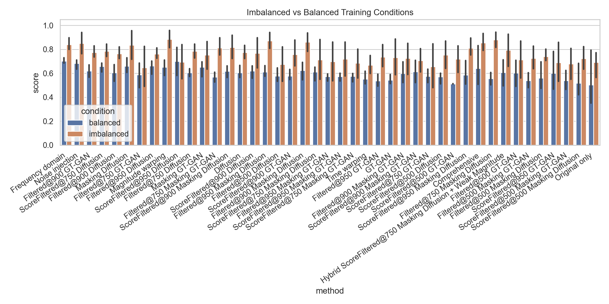
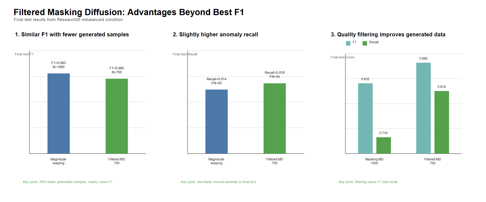
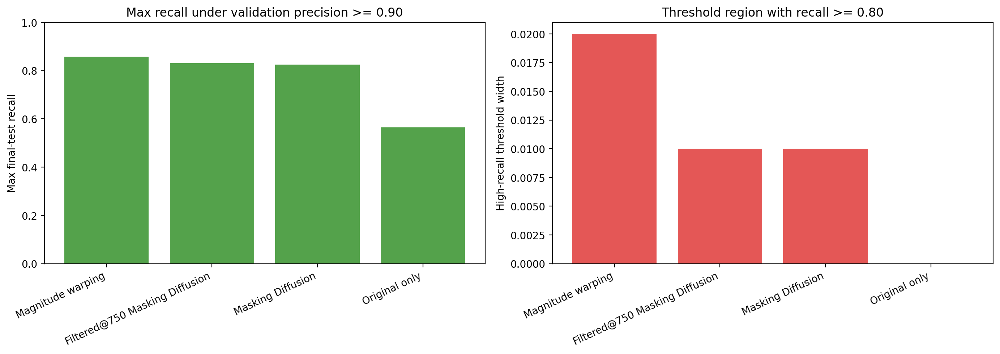
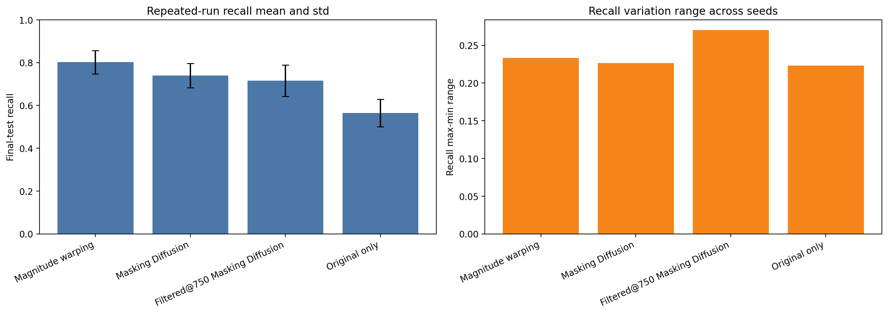
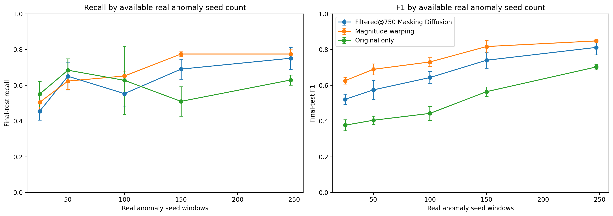

# Manufacturing Anomaly Detection Data Augmentation Research

제조 용접 공정 시계열 데이터에서 매우 적은 불량 샘플만으로 이상 탐지 성능을 개선할 수 있는지 검증한 연구입니다. 핵심 조건은 정상 데이터가 압도적으로 많고, 학습에 사용할 수 있는 실제 불량 seed가 247개뿐이라는 점입니다.

이 저장소는 원본 데이터 기반 baseline부터 생성형 증강, 전통적 시계열 증강, 품질 필터링, 임계값 강건성, 반복 실행 안정성, scarce seed 조건까지의 전체 연구 과정을 포함합니다.

## 연구 질문

- 실제 불량 seed만 사용하는 모델보다 증강 데이터를 추가한 모델이 이상 탐지 성능을 개선하는가?
- 생성형 시계열 증강은 전통적 시계열 증강보다 실용적으로 우수한가?
- 성능 개선은 생성 샘플 수 증가 때문인가, 클래스 비율 보정 때문인가?
- validation에서 선택한 임계값이 final test에서도 안정적으로 작동하는가?
- 불량 seed가 더 적은 조건에서도 증강 전략의 효과가 유지되는가?

## 데이터 분할

최종 성능은 학습 및 임계값 선택에 사용하지 않은 `final_test` split에서 평가했습니다. 임계값은 `validation` split에서만 선택해 test leakage를 피했습니다.

| Split | Windows | Normal | Anomaly | 역할 |
| --- | ---: | ---: | ---: | --- |
| `normal_train` | 135,730 | 135,730 | 0 | 정상 학습 후보 |
| `anomaly_train_seed` | 247 | 0 | 247 | 실제 불량 seed |
| `validation` | 1,447 | 1,283 | 164 | 임계값 선택 |
| `final_test` | 3,081 | 2,785 | 296 | 최종 평가 |

## 연구 흐름

### Research01: 원본 데이터 baseline

실제 불량 seed 247개와 정상 window 5,000개만 사용해 RandomForest baseline을 만들었습니다. 원본 데이터만으로도 precision은 높았지만 recall이 낮아 실제 불량을 놓치는 문제가 확인되었습니다.

| Method | Generated anomalies | Precision | Recall | F1 | AUROC | AUPRC |
| --- | ---: | ---: | ---: | ---: | ---: | ---: |
| Real anomaly only | 0 | 0.855 | 0.618 | 0.718 | 0.959 | 0.800 |

결과 파일:

- `data/research01/results/research01_randomforest_baseline_summary.json`
- `data/research01/figures/randomforest_original_baseline_confusion_matrix.png`

### Research02: 생성 데이터 품질 비교

GT-GAN, Diffusion, Masking GT-GAN, Masking Diffusion을 비교했습니다. 일반 GT-GAN/Diffusion은 전체 window를 noise에서 생성하고, masking 계열은 실제 불량 seed의 관측값을 보존하면서 선택된 시간 구간과 feature group만 복원하도록 구성했습니다.

Masking 전략은 element-wise random masking이 아니라 데이터 기반 temporal block 및 feature-group masking입니다. 정상-불량 분포 차이가 큰 시간 영역과 feature group을 우선적으로 가리며, Masking Diffusion은 GRU 기반 temporal denoiser를 사용했습니다.

품질 평가는 t-SNE, 생성 샘플 품질 지표, IsolationForest downstream 성능으로 확인했습니다. 생성 품질 관점에서는 masking 계열이 일반 생성 방식보다 실제 불량 분포에 더 가깝게 나타났습니다.



### Research03: 지도학습 증강 검증

생성 불량 window를 RandomForest 학습 데이터에 추가하고, 임계값은 실제 validation split에서 선택한 뒤 final test에서 한 번 평가했습니다. 여기서 가장 좋은 결과는 Masking Diffusion 1,000개 증강 조건이었습니다.

| Method | Generated anomalies | Precision | Recall | F1 | AUROC | AUPRC |
| --- | ---: | ---: | ---: | ---: | ---: | ---: |
| Real anomaly only | 0 | 0.855 | 0.618 | 0.718 | 0.959 | 0.800 |
| Masking Diffusion | 1,000 | 0.962 | 0.764 | 0.851 | 0.990 | 0.938 |

이 단계에서는 생성형 증강이 원본 baseline보다 F1, recall, AUPRC를 모두 개선했습니다.



### Research04: Diffusion 계열 threshold 최적화

Diffusion 1,000개 및 Masking Diffusion 1,000개 조건에 대해 RandomForest hyperparameter와 임계값 전략을 추가 검증했습니다. 임계값은 validation에서 선택하고 final test에서 평가했습니다.

| Method | Strategy | Threshold | Precision | Recall | F1 | AUPRC |
| --- | --- | ---: | ---: | ---: | ---: | ---: |
| Diffusion | best validation F1 | 0.81 | 0.972 | 0.807 | 0.882 | 0.961 |
| Diffusion | max recall with validation precision >= 0.80 | 0.78 | 0.843 | 0.889 | 0.865 | 0.961 |
| Masking Diffusion | best validation F1 | 0.83 | 0.918 | 0.912 | 0.915 | 0.971 |
| Masking Diffusion | max recall with validation precision >= 0.80 | 0.79 | 0.835 | 0.956 | 0.891 | 0.971 |

이 결과는 threshold 선택 방식에 따라 precision-recall trade-off가 크게 달라진다는 점을 보여줍니다. 특히 Masking Diffusion은 튜닝된 조건에서 높은 F1과 높은 recall 전략을 모두 제공했습니다.

### Research05: 생성형 vs 전통적 증강, balanced vs imbalanced

생성형 증강, 품질 필터링된 생성형 증강, score-filtered 증강, hybrid 증강, 전통적 시계열 증강을 비교했습니다. 또한 정상 데이터를 불량 수에 맞춰 줄이는 balanced 조건과 정상 5,000개를 유지하는 imbalanced 조건을 분리해 비교했습니다.

핵심 결론은 단순한 1:1 클래스 균형이 항상 유리하지 않다는 점입니다. 정상 데이터를 과하게 downsampling하면 정상 분포 정보가 손실되어 final test 성능이 낮아졌습니다.

| Condition | Best method | Precision | Recall | F1 | AUROC | AUPRC |
| --- | --- | ---: | ---: | ---: | ---: | ---: |
| Balanced | Frequency domain | 0.698 | 0.686 | 0.692 | 0.954 | 0.729 |
| Imbalanced | Magnitude warping | 0.964 | 0.814 | 0.883 | 0.994 | 0.959 |

생성형 계열만 보면 imbalanced 조건의 `Filtered@750 Masking Diffusion`이 가장 실용적인 후보였습니다.

| Method | Generated anomalies | Precision | Recall | F1 | AUROC | AUPRC |
| --- | ---: | ---: | ---: | ---: | ---: | ---: |
| Masking Diffusion | 1,000 | 1.000 | 0.716 | 0.835 | 0.993 | 0.956 |
| Filtered@750 Masking Diffusion | 750 | 0.953 | 0.818 | 0.880 | 0.991 | 0.944 |
| Magnitude warping | 1,000 | 0.964 | 0.814 | 0.883 | 0.994 | 0.959 |



### Research06: 생성 샘플 필터링

생성 샘플을 모두 쓰지 않고 품질 기준으로 선별하는 실험을 추가했습니다. 필터링은 실제 불량 centroid와의 근접성, 정상 centroid와의 분리도, 실제 불량 feature range와의 일관성을 함께 고려했습니다.

결과적으로 생성형 증강은 “많이 생성하는 것”보다 “품질이 좋은 샘플을 선별해 넣는 것”이 더 중요했습니다. `Filtered@750 Masking Diffusion`은 원본 baseline보다 recall과 F1을 크게 올리면서도 precision을 높은 수준으로 유지했습니다.



### Research07: 강건성, 반복 안정성, scarce seed 분석

최종적으로 연구 결과를 실제 적용 관점에서 다시 검증했습니다.

1. precision floor 0.90 조건에서 threshold sweep을 수행했습니다.
2. 주요 후보를 30회 반복 실행해 평균 성능과 분산을 확인했습니다.
3. 불량 seed가 25, 50, 100, 150, 247개로 줄어드는 상황을 비교했습니다.

#### Precision floor 0.90 threshold sweep

| Method | Max recall at precision >= 0.90 | Best precision | Best threshold |
| --- | ---: | ---: | ---: |
| Magnitude warping | 0.858 | 0.910 | 0.80 |
| Filtered@750 Masking Diffusion | 0.831 | 0.904 | 0.84 |
| Masking Diffusion | 0.824 | 0.914 | 0.84 |
| Original only | 0.564 | 0.923 | 0.91 |

#### 30회 반복 실행 안정성

| Method | Precision mean | Recall mean | F1 mean | AUPRC mean |
| --- | ---: | ---: | ---: | ---: |
| Original only | 0.838 | 0.564 | 0.668 | 0.784 |
| Masking Diffusion | 0.929 | 0.740 | 0.821 | 0.924 |
| Filtered@750 Masking Diffusion | 0.899 | 0.716 | 0.792 | 0.911 |
| Magnitude warping | 0.931 | 0.802 | 0.860 | 0.950 |

#### Seed 부족 조건

247개 seed 기준에서는 Magnitude warping이 평균 F1 0.848, 평균 AUPRC 0.949로 가장 안정적이었습니다. 150개 seed에서도 Magnitude warping은 평균 F1 0.817, 평균 recall 0.775를 유지했습니다. 반면 seed가 25개처럼 극단적으로 적은 경우에는 모든 방법의 성능이 크게 낮아져, 증강만으로 데이터 부족을 완전히 해결할 수 없다는 한계도 확인했습니다.







## 최종 결론

원본 데이터만 사용하는 RandomForest baseline은 precision은 높지만 recall이 낮았습니다. 즉, 정상으로 잘못 통과시키는 불량 window가 많았습니다. 생성형 증강, 특히 Masking Diffusion은 이 문제를 개선했고, 품질 필터링을 적용한 `Filtered@750 Masking Diffusion`은 생성형 후보 중 가장 실용적인 성능을 보였습니다.

다만 전체 연구를 통틀어 최종적으로 가장 안정적인 방법은 전통적 시계열 증강인 `Magnitude warping`이었습니다. 30회 반복 실행, precision floor threshold sweep, scarce seed 분석에서 모두 높은 평균 성능과 낮은 변동성을 보였습니다.

따라서 이 연구의 결론은 “생성형 증강이 항상 전통적 증강보다 우수하다”가 아닙니다. 제조 시계열 이상 탐지처럼 불량 seed가 적고 정상 데이터가 많은 문제에서는 다음 조건들이 함께 성능을 결정했습니다.

- 정상 데이터를 과하게 버리지 않고 imbalanced 구조를 유지하는 것
- validation split에서 임계값을 선택하고 final test를 분리하는 것
- 생성 샘플은 수량보다 품질 필터링을 우선하는 것
- 전통적 증강과 생성형 증강을 모두 후보로 두고 반복 안정성을 비교하는 것

## 프로젝트 구조

```text
data/
  raw_data/              원본 train/test 데이터
  preprocessed/          라벨 정리 및 전처리 데이터
  augmentation_split/    normal/anomaly seed/validation/final test 분할
  baseline/              초기 baseline 모델 비교 결과
  research01/            원본 데이터 RandomForest baseline
  research02/            GT-GAN, Diffusion, Masking 생성 데이터 품질 비교
  research03/            생성형 증강의 지도학습 성능 검증
  research05/            balanced/imbalanced 및 전통적 증강 비교
  research07/            임계값 강건성, 반복 안정성, scarce seed 분석
notebooks/
  Research01_baseline_pipeline.ipynb
  Research02_Generate_Data.ipynb
  Research03_Validate_Data.ipynb
  Research04_MaskingDiffusion_RF_Threshold_Optimization.ipynb
  Research05_Balanced_vs_Imbalanced_Augmentation.ipynb
  Research06_filtering.ipynb
  Research07.ipynb
tools/
  research01_randomforest_baseline.py
  research02_generate_data.py
  research03_model_augmented_validation.py
  research03_diffusion1000_hyperparameter_tuning.py
  research03_diffusion1000_threshold_optimization.py
  research05_balanced_aug_experiment.py
```

<<<<<<< HEAD
## 재현 방법
=======
## Data Split

최종 성능 평가는 학습과 분리된 final test 윈도우에서 수행했습니다. 임계값은 final test에 직접 맞추지 않고 validation split에서만 선택했습니다.

| Split | Windows | Normal | Anomaly |
| --- | ---: | ---: | ---: |
| normal_train | 135,730 | 135,730 | 0 |
| anomaly_train_seed | 247 | 0 | 247 |
| validation | 1,447 | 1,283 | 164 |
| final_test | 3,081 | 2,785 | 296 |

## Experiment Flow

1. **Research01: Baseline**
   - 원본 불량 seed 247개와 정상 윈도우 5,000개만 사용해 RandomForest 기준 모델을 구성했습니다.
   - 기준 모델의 final test F1은 0.718, recall은 0.618입니다.

2. **Research02: Generated Data Quality**
   - GT-GAN, Diffusion, Masking GT-GAN, Masking Diffusion을 비교했습니다.
   - Masking 계열은 실제 불량 seed의 관측 값을 보존하고, 시간 블록과 feature group 단위로 가려진 영역만 복원하도록 설계했습니다.
   - 생성 품질 평가는 t-SNE, 품질 지표, IsolationForest 기반 downstream 성능으로 확인했습니다.

   

3. **Research03: Supervised Augmentation Validation**
   - 생성 불량 윈도우를 RandomForest 학습 데이터에 추가하고, validation split에서 선택한 임계값으로 final test를 평가했습니다.
   - 가장 좋은 결과는 Masking Diffusion 1,000개 증강 조건에서 나왔습니다.

   

4. **Research05: Balanced vs Imbalanced Augmentation**
   - 생성형 증강, 품질 필터링 생성형 증강, 전통적 증강, hybrid 증강을 비교했습니다.
   - balanced 조건은 정상 데이터를 불량 수에 맞춰 downsampling했고, imbalanced 조건은 정상 5,000개를 유지했습니다.
   - 최종적으로 imbalanced 조건에서 전통적 Magnitude warping이 가장 높은 F1을 보였고, 생성형 계열에서는 Filtered Masking Diffusion이 강한 대안으로 확인됐습니다.

   

5. **Research07: Portfolio Robustness Analysis**
   -  임계값 강건성, 반복 실행 안정성, 불량 seed 부족 조건을 추가 분석
   - 단일 최고 점수만 제시하지 않고, 실제 적용 시 선택 가능한 임계값 폭과 seed 수 변화에 따른 성능 변화를 함께 정리했습니다.

   

   

   

## Key Results

### Baseline vs Best Augmentation

| Method | Generated anomalies | Precision | Recall | F1 | AUROC | AUPRC |
| --- | ---: | ---: | ---: | ---: | ---: | ---: |
| Real anomaly only | 0 | 0.855 | 0.618 | 0.718 | 0.959 | 0.800 |
| Masking Diffusion | 1,000 | 0.962 | 0.764 | 0.851 | 0.990 | 0.938 |
| Magnitude warping | 1,000 | 0.964 | 0.814 | 0.883 | 0.994 | 0.959 |
| Filtered@750 Masking Diffusion | 750 | 0.953 | 0.818 | 0.880 | 0.991 | 0.944 |

### Research07 Robustness Summary

| Analysis | Best observed method | Main takeaway |
| --- | --- | --- |
| Precision floor threshold sweep | Magnitude warping | Precision 0.90 이상을 유지하면서 최대 recall 0.858까지 확보 |
| 30-run stability | Magnitude warping | 평균 F1 0.860, 평균 recall 0.802로 반복 실행 안정성이 가장 높음 |
| Scarce seed analysis | Magnitude warping | seed가 25, 50, 100, 150, 247개일 때 전반적으로 가장 안정적 |
| Generative alternative | Filtered@750 Masking Diffusion | 생성형 증강 중 가장 실용적인 후보로, 247 seed 조건에서 평균 F1 0.812와 AUPRC 0.907 기록 |

## Interpretation

원본 데이터만 사용한 기준 모델은 precision은 높지만 recall이 낮아 실제 불량을 놓치는 문제가 있었습니다. Masking Diffusion은 원본 seed의 구조를 보존하면서 가려진 구간만 복원하는 방식으로 기준 모델 대비 F1과 AUPRC를 크게 개선했습니다.

다만 최종 robustness 분석에서는 전통적 Magnitude warping이 가장 높은 평균 성능과 안정성을 보였습니다. 이 결과는 생성형 증강 자체가 항상 우월하다기보다, 불량 seed 수가 적은 제조 시계열 문제에서는 증강 방식의 품질 관리, 클래스 비율, 임계값 선택이 함께 성능을 결정한다는 점을 보여줍니다.

## Reproduce
>>>>>>> 32af75627263fd86497f0001bb73b5e948ec8d37

필요 패키지 예시는 다음과 같습니다.

```powershell
pip install numpy pandas matplotlib seaborn scikit-learn torch
```

저장소 루트에서 주요 실험 스크립트를 순서대로 실행할 수 있습니다.

```powershell
python tools/research01_randomforest_baseline.py
python tools/research02_generate_data.py
python tools/research03_model_augmented_validation.py
python tools/research03_diffusion1000_hyperparameter_tuning.py
python tools/research03_diffusion1000_threshold_optimization.py
python tools/research05_balanced_aug_experiment.py
```

각 실험의 CSV, JSON, figure 산출물은 `data/researchXX/` 하위에 저장되어 있습니다.

## 주의 사항

- 모든 주요 수치는 `final_test` split 기준입니다.
- 임계값은 `validation` split에서만 선택했습니다.
- `Research04`와 `Research06`은 각각 threshold 최적화와 생성 샘플 필터링 분석으로, 산출물은 `research03` 및 `research05` 결과 디렉터리에 함께 정리되어 있습니다.
- 최종 모델 선택은 단일 최고 점수뿐 아니라 threshold 강건성, 반복 실행 안정성, seed 부족 조건까지 함께 고려해야 합니다.
